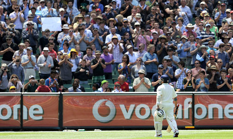
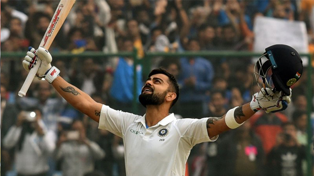
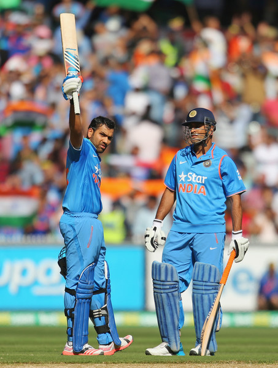
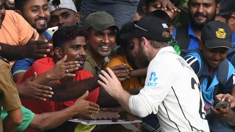

# About Cricket Champions
## There are many cricket champions in the world who brought fame and reputation to their countries.
## Among them only few got recognitions from their respective cricket boards (CB) because of their tremendous play by maintaining good batting and bowling averages in their respective fields
## If we come across the cricket world, cricketers like,
1. Sachin Tendulkar
2. M S Dhoni
3. Virat Kohli 
4. Rohit Sharma, got good recognition from the cricket board India.
## Known for,
* In India, [Sachin](https://en.wikipedia.org/wiki/Sachin_Tendulkar) is called as god of cricket for passion and love towards his profession
* [Virat kohli](https://en.wikipedia.org/wiki/Virat_Kohli) is called as Mr. consistency for maintaining good batting average in all the tournaments.
* [Dhoni](https://en.wikipedia.org/wiki/MS_Dhoni) is well known for his helicopter shot
* [Rohit sharma](https://en.wikipedia.org/wiki/Rohit_Sharma) is referred as Hitman for his fierceful shots.
## Outstanding moments,
Here are the few outstanding moments where cricketers got standing ovation from the audience.

## Image References
- [https://images.app.goo.gl/KMBKTmnhzSvaAPfE6](https://images.app.goo.gl/KMBKTmnhzSvaAPfE6)
- [https://images.app.goo.gl/pF5YbyRvFqMsKbuQ8](https://images.app.goo.gl/pF5YbyRvFqMsKbuQ8)
- [https://images.app.goo.gl/EusVojiy1PWZ4a69A](https://images.app.goo.gl/pF5YbyRvFqMsKbuQ8)

