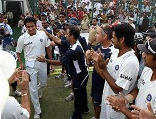
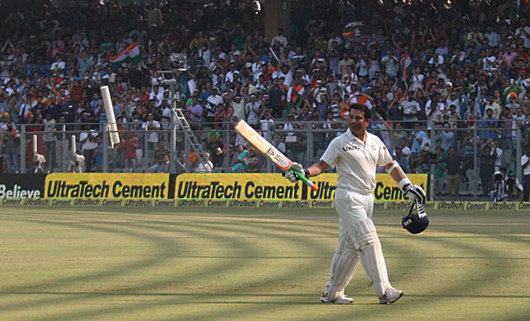

# Cricket-Champions
## There are many cricket champions in the world who brought fame and reputation to their countries.
## Among them only few got recognitions from their respective cricket boards (CB) because of their tremendous play by maintaining good batting and bowling averages in their respective fields
If we come across the cricket world, cricketers like
1. Sachin Tendulkar
2. M S Dhoni
3. Virat Kohli 
4. Rohit Sharma, got good recognition from the cricket board India
* In India sachin is called as god of cricket for passion and love towards his profession
* Virat kohli is called as Mr. consistency for maintaining good batting average in all the tournaments.
> Here are the few outstanding moments where cricketers got standing ovation from the audience.

![standing ovation picture 3]

